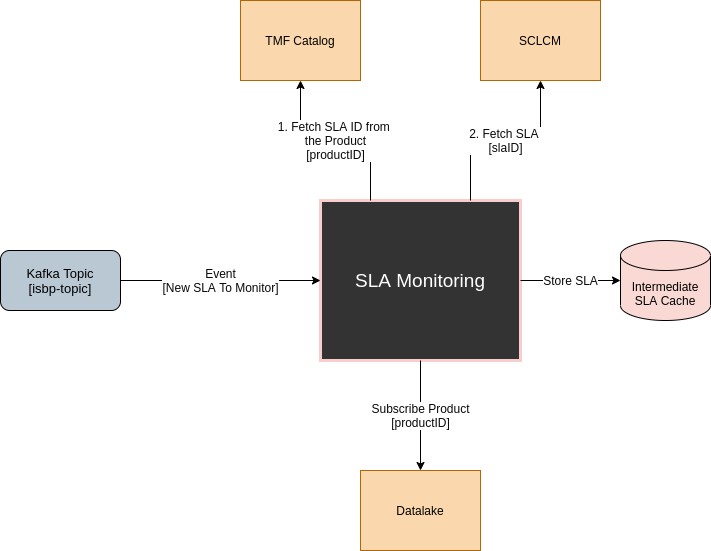
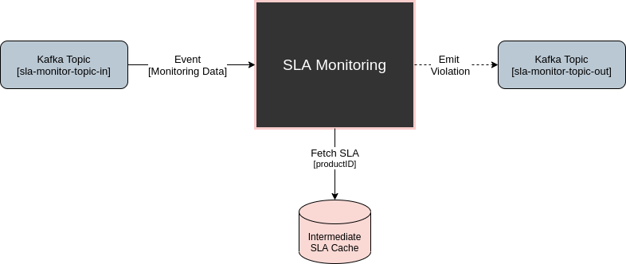
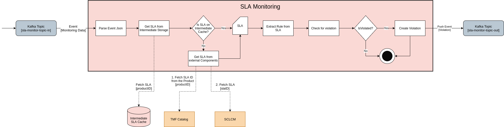

# SLA-Monitor
Repository for the SLA-Monitor component

## Modules

Code divided into 5 modules. 
```
consumer.js - Contains logic for Kafka consumers (SLA and Monitoring consumers)
producer.js - Contains logic for a Kafka producer
sla.js      - Contains logic for Accord Project
redis.js    - Contains redis logic to serve as an intermediate storage for the SLAs
external.js - Contains logic that connect to external components (FetchSLA and SubscribeDL)
```

We have 2 Kafka consumers since we listen to 2 kafka-topics:
```
1. isbp-topic                - New SLA events
2. sla-monitoring-topic-in   - New monitoring data events 
```


## Logic

Logic in the component can be separated into two phases.
1. **Preparation**
In this phase we listen to a previously set kafka topic (isbp-topic) in which ProductIds, related to a specific SLA, to be monitored arrive as events. These events are copied over in the Datalake and come from the ISSM. The arrival of such event, triggers a sequence of logic:
 - Listen to isbp-topic for Events containing ProductID.
 - Fetch Product from TMF Catalog using the ProductID and retrieve the SLA_ID or the SLA_Href.
   - Fetch SLA from SCLCM using the SLA_ID or the SLA_Href
   - Store the SLA for future use.
 - Subscribe to the Product in the Datalake using the ProductId 



2. **Monitorization**
In this phase, we wait for data to arrive to our kafka input topic and when it does we check if a clause has been violated, emitting a violation if needed. It stands to reason that while the monitoring data comes from the MDA, it is the datalake that copies it into our input topic.

-  (Pre-Setup) Connect to sla-monitor-topic-in in the datalake
- Monitoring Data Event Arrives 
  - Retrieve the ProductId from the Event
- Get the SLA from Storage
  - (If not stored) Get the Product from the TMF Catalog API using this ProductId
  - (If not stored) Retrieve the SLA id from the Product 
  - (If not stored) Get the SLA from the SCLM component using the SLA Id
- Check for Clause Violation
- (If True) Emit Violation




## Logic Expanded
### **Preparation Phase**

1. From the SLA Data Event that is consumed from the Kafka Topic, we fetch the **ProductId**. In the isbp-topic there are 2 types of events arriving
- New SLA ACK data event from ISSM Example
```
{
  "eventType": "new_SLA_ACK",
  "transactionID": "5f1da43fcc3c46809ce70b3186d0d2cd",
  "productID": "3e922f24-01ec-4f83-8328-b69dc9ab8f8e",
  "status": "COMPLETED"
}
```

- New SLA data event from ISSM Example
```
{
  "eventType": "new_SLA",
  "transactionID": "b1afede1a6014998812e9796327b40ee",
  "productID": "VHRN56FxhC5YQYkZSLK5KG",
  "instanceID": "153",
  "place": {
    "id": "9d6301ac-698c-4ed0-bd28-b0446b0b305c",
    "href": "http://172.28.3.126:31080/tmf-api/geographicAddressManagement/v4/geographicAddress/9d6301ac-698c-4ed0-bd28-b0446b0b305c",
    "city": "Barcelona",
    "country": "Spain",
    "locality": "Barcelona",
    "geographicLocation": {
      "id": "f17148e1-b874-4e2e-a81e-86738d0ee044",
      "name": "Barcelona i2CAT Area, Spain ",
      "geometryType": "string",
      "geometry": [
        {
          "id": "c45f6cc2-85af-4f64-95d8-25f9ba775fab",
          "x": "41.3879",
          "y": "2.1699",
          "z": "3388.0"
        }
      ]
    }
  },
  "kafka_ip": "172.28.3.196",
  "kafka_port": "9092",
  "topic": "isbp-topic-out"
}
```

2. The **ProductId** is used to get the Product from the TMF Catalog which has a **ServiceLevelAgreement** Field.
```
  TMF Catalog API URL

  GET /tmf-api/productCatalogManagement/v4/productOffering/{id}
```

```
  SLA field from Product 

  ...
  "serviceLevelAgreement": {
    "@baseType": "string",
    "@referredType": "string",
    "@schemaLocation": "string",
    "@type": "string",
    "description": "string",
    "href": "string",
    "id": "string",
    "lastUpdate": "string",
    "lifecycleStatus": "string",
    "lifecycleStatusEnum": "Active",
    "name": "string",
    "validFor": {
      "endDateTime": "string",
      "startDateTime": "string"
    },
    "version": "string"
  }
```

3. From the Product, we retrieve the **Sla Id** or the **SLA Href** field which will be used to fetch the SLA Template and its clauses from the SCLCM component.

4. We can either use the **SLA Id**, to fetch the SLA from the SCLCM component or we can directly use the **SLA Href** field which holds the URL to directly fetch the SLA. It stands to reason that we currently retrieve the href field and use it to fetch the SLA.

```
  SCLCM API URL

  GET http://172.28.3.111/operatora/smart-contract-lifecycle-manager/
```

```
  SLA from SCLCM 

{
  "id": "string",
  "href": "string",
  "name": "string",
  "description": "string",
  "version": "string",
  "validFor": {
    "endDateTime": "string",
    "startDateTime": "string"
  },
  "templateRef": {
    "href": "string",
    "name": "string",
    "description": "string"
  },
  "state": "string",
  "approved": true,
  "approvalDate": "2022-01-04T15:04:51.074Z",
  "rule": [
    {
      "id": "string",
      "metric": "string",
      "unit": "string",
      "referenceValue": "string",
      "operator": "string",
      "tolerance": "string",
      "consequence": "string"
    }
  ],
  "relatedParty": [
    {
      "href": "string",
      "role": "string",
      "name": "string",
      "validFor": {
        "endDateTime": "string",
        "startDateTime": "string"
      } } ] }
```

5. Having the **SLA**, we store it in a Key-Value storage (Redis in this case) so as to have an intermediate storage which will allow us to more quickly retrive the SLA in question without having to query other components. Stored in the following format:
```
key: productId
value: SLA 
```

6. Last but not least, we move on to using the **ProductId** to subscribe to that products events in the datalake. This subscription will trigger the datalake to copy all present and future events to our input topic.


### **Monitorization Phase**




1. From the Monitoring Data Event that is consumed from the Kafka Topic, we fetch the **ProductId** and other needed information like **metricValue** and **metricName**. These fields are validated before continuing.

```
Monitoring data event from MDA Example

data = {
    "operatorID" : "id_example",
    "networkID" :  "network_slice_id",
    "monitoringData" :  
    {
        "metricName" :  "http://www.provider.com/metrics/availability",
        "metricValue" :  "0.453",
        "transactionID" :  "7777",
        "productID" :  "8888",
        "instanceID" : "2",
        "resourceID" : "X",
        "timestamp": "the time which the metric was measured"
    },
}
```

2. This **ProductID** can be used to fetch the SLA from the local intermediate storage or to re-fetch it from the SCLCM component (As previously mentioned in the Preparation Phase) if needed.

3. After fetching the SLA, we extract the required information from it:
```
Id    - For filling in the the violation if required.
Href  - For filling in the the violation if required.
Rules - So we can find the values to check if a violation occurred.
```

4. With the Rules array, we then search for a clause that has the same metric name that of the monitoring data event. Having that specific clause/rule we then verify if it has all the fields required:
```
operator - Indicator or the range we want (For availability we want data to have values greater than some base value)
referenceValue - Base value that is compared with the actual recorded data
tolerance - Error margin for the value
```

5. We check for violations in the following way. Based on the operator, we either sum or subtract the tolerance to the reference value and compare it to the actual data obtained from the monitoring event. That is because the operator defines how the tolerance affects the outcome.  
For example, for availability, for a violation to occur, the value read must be smaller than the reference - tolerance (99.95 - 0.05 > value).   
As to the response time, for a violation to occur, the value read must be bigger than the reference + tolerance (80 + 15 < value)   

```
case '.g':
  return value > reference + tolerance 
case '.ge':
  return value >= reference + tolerance 
case '.l':
  return value < reference - tolerance
case '.le':
  return value <= reference - tolerance 
case '.eq':
  return reference - value == 0
```

Examples:
```
if response is greater than 80 + 15 -> violated (value >= reference + tolerance)
if availability is lesser than 99.95 - 0.05 -> violated (value <= reference - tolerance )
if requests/min is greater than 2600 + 100 -> violated (value >= reference + tolerance )
```


6. Next, if step 5. was sucessful and a violation occurred, we now have to create the violation 
How we create the violation
```
{
  "id": uuidv4(),
  "productID": productID
  "sla": {
    "id": slaId, 
    "href": slaHref
  },
  "rule": rule,
  "violation": {
    "actualValue": value,
  }
}
```

Violation Example
```
{
  "id": "9b1deb4d-3b7d-4bad-9bdd-2b0d7b3dcb6d", 
  "productID": "9b1deb4d-3b7d-4bad-9bdd-2b0d7b3dcb6d",
  "sla": {
    "id": "9b1deb4d-3b7d-4bad-9bdd-2b0d7b3dcb6d", 
    "href": "http://www.acme.com/slaManagement/sla/123444"
  },
  "rule": {
    "id": "availability",
    "metric": "http://www.provider.com/metrics/availability",
    "unit": "%",
    "referenceValue": "99.95",
    "operator": ".ge",
    "tolerance": "0.05",
    "consequence": "http://www.provider.com/contract/claus/30"
  },
  "violation": {
    "actualValue": "90.0",
}
```

7. Last but not least, after creating the violation, we need to push the violation event to the output kafka topic previously provided by the datalake.


## How logic should be using Accord Project
0. Monitoring Data arrives and we fetch the template
1. Instantiate Template
2. Add Clauses
3. Trigger the Logic (Previously implemented in the Template) using the monitoring data event
4. If needed, Emit a Violation

### Practical
As to the SLA logic (In Accord Project) we basically:

1. Instantiate the SLA Engine
```
const sla = new SLA();
```

2. Set the Template (For testing scenario we use a local template)
```
await sla.setTemplateFromLocalArchive('./examples/full-payment-upon-demand@0.9.0.cta');
```
3. Set Clauses Data 
```
const clauseJson = {
  data: {
    $class:
    "org.accordproject.payment.fullupondemand.FullPaymentUponDemandTemplate",
    buyer: "resource:org.accordproject.party.Party#Dan",
    seller: "resource:org.accordproject.party.Party#Jerome",
    value: {
    $class: "org.accordproject.money.MonetaryAmount",
    doubleValue: 3.14,
    currencyCode: "EUR",
  },
  contractId: "d3b7e05a-d889-4604-b4bf-3c72eb773d4c",
  $identifier: "d3b7e05a-d889-4604-b4bf-3c72eb773d4c", },};


sla.setClauseData(clauseJson.data);
```
4. Trigger the Logic
```
var requestJson = {
  request: {
  $class: "org.accordproject.payment.fullupondemand.PaymentDemand",
  $timestamp: "2021-04-27T13:10:37.715-04:00",
  },
  state: {
  $class:
      "org.accordproject.payment.fullupondemand.FullPaymentUponDemandState",
  status: "INITIALIZED",
  $identifier: "7c89e540-a77b-11eb-9770-7ddd576a12c2",
  },
  contractId: "d3b7e05a-d889-4604-b4bf-3c72eb773d4c",
};

const result = await sla.engineTrigger(requestJson.request, requestJson.state);
```

## Datalake Interaction
Firstly, we need to register a user
```
  curl -i -H "Content-Type: application/json" -X POST -d ' { "userId": "sla-monitor", "authToken": "blah" } ' 172.28.3.94:8080/datalake/v1/user
```

Answer:
```
  HTTP/1.0 201 CREATED
  Content-Type: application/json
  Content-Length: 545
  Server: Werkzeug/1.0.1 Python/3.8.10
  Date: Mon, 20 Dec 2021 09:56:23 GMT

  {
    "availableResources": {
      "pipelines": {
        "resourceMetricsIngestPipeline": "sla-monitor-in-0"
      },
      "s3_bucket": "sla-monitor-dl-bucket",
      "topics": {
        "userInTopic": "sla-monitor-topic-in",
        "userOutTopic": "sla-monitor-topic-out"
      },
      "urls": {
        "dl_catalog_server_url": "172.28.3.46:32579",
        "dl_stream_data_server_url": "172.28.3.46:30887",
        "k8s_url": "172.28.3.46:6443",
        "kafka_url": "172.28.3.196:9092",
        "s3_url": "172.28.3.188:9000"
      }
    },
    "nameSpace": "sla-monitor"
  }
```


Ask the datalake for a certain productID stream
The datalake will fetch that productId info from ISSM output topic (isbp-topic) and copy them to our input topic

Subscribe a productID
```
curl -i -H "Content-Type: application/json" -X POST -d ' { "userInfo": { "userId": "sla-monitor", "authToken": "blah" }, "productInfo": { "topic": "sla-monitor-topic-in" } } ' http://172.28.3.46:30887/datalake/v1/stream_data/register/<PRODUCTID>

```

Check all users
```
  curl -i -H "Content-Type: application/json" -X GET -d ' { "userId": "sla-monitor", "authToken": "blah" } ' 172.28.3.94:8080/datalake/v1/user/all
```


# Links

SCLCM Swagger
```
http://172.28.3.111:31080/smart-contract-lifecycle-manager/swagger-ui/index.html?configUrl=/smart-contract-lifecycle-manager/api-docs/swagger-config#/
```

TMF Catalog Swagger
```
http://172.28.3.126:31080/tmf-api/swagger-ui/#/
```